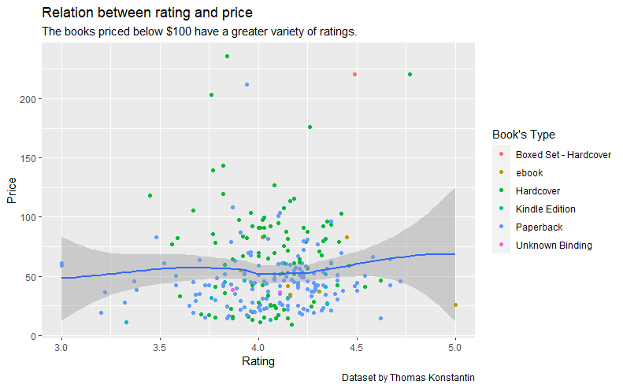

# R-Assignment 4

**Created by Pattarapon Makhirun (ID: 63130500091)**

Choose Dataset:
1. Top 270 Computer Science / Programing Books (Data from Thomas Konstantin, [Kaggle](https://www.kaggle.com/thomaskonstantin/top-270-rated-computer-science-programing-books)) >> [Using CSV](https://raw.githubusercontent.com/safesit23/INT214-Statistics/main/datasets/prog_book.csv)


### Outlines
1. Explore the dataset
2. Learning function from Tidyverse
3. Transform data with dplyr and finding insight the data
4. Visualization with GGplot2

## Part 1: Explore the dataset
### Importing libraries and dataset

``` ruby
# Library 
library(dplyr)
library(ggplot2)
library(DescTools)

# Dataset
PROG_BOOK <- read.csv("C:/Users/User/Desktop/INT214/prog_book.csv")
View(PROG_BOOK)
glimpse(PROG_BOOK)
```
### Result
```ruby
Rows: 271
Columns: 7
$ Rating          <dbl> 4.17, 4.01, 3.33, 3.97, 4.06, 3.84, 4.09, 4.15, 3.87, 4.62, 4.03, 3.78, 3.73, 3.87, 3.87, 3.95, 3.85, 3.94, 3.75, 4.1~
$ Reviews         <chr> "3,829", "1,406", "0", "1,658", "1,325", "117", "5,938", "1,817", "2,093", "0", "160", "481", "33", "1,255", "593", "~
$ Book_title      <chr> "The Elements of Style", "The Information: A History, a Theory, a Flood", "Responsive Web Design Overview For Beginne~
$ Description     <chr> "This style manual offers practical advice on improving writing skills. Throughout, the emphasis is on promoting a pl~
$ Number_Of_Pages <int> 105, 527, 50, 393, 305, 288, 256, 368, 259, 128, 352, 352, 200, 328, 240, 288, 392, 304, 336, 542, 192, 242, 224, 412~
$ Type            <chr> "Hardcover", "Hardcover", "Kindle Edition", "Hardcover", "Kindle Edition", "Paperback", "Hardcover", "Hardcover", "Ha~
$ Price           <dbl> 9.323529, 11.000000, 11.267647, 12.873529, 13.164706, 14.188235, 14.232353, 14.364706, 14.502941, 14.641176, 15.22941~
```
In this dataset has <b>271 observations and 7 attributes</b>
### Start exploring the data

### Let's see is there any duplicate data.
```ruby
PROG_BOOK %>% filter(duplicated(PROG_BOOK))
```

### Result
```ruby
Rating          Reviews         Book_title      Description     Number_Of_Pages Type            Price          
<0 rows> (or 0-length row.names)
```
There is no duplicated data.

### Lets see is there any NA data
```ruby
is.na(PROG_BOOK) %>% summary()
```

### Result
```ruby
 Rating         Reviews        Book_title      Description     Number_Of_Pages    Type           Price        
 Mode :logical   Mode :logical   Mode :logical   Mode :logical   Mode :logical   Mode :logical   Mode :logical  
 FALSE:271       FALSE:271       FALSE:271       FALSE:271       FALSE:271       FALSE:271       FALSE:271  
```
There is no NA data.
## Part 2: Learning function from Tidyverse

- Function `` from package [dplyr](https://dplyr.tidyverse.org/articles/dplyr.html#select-columns-with-select)). It using for select columns

```
starwars %>% select(name,height)
```
** You can sepearate this part or combine in part of `Transform data with dplyr and finding insight the data`

## Part 3: Transform data with dplyr and finding insight the data

### 1. จำนวนของหนังสือที่มีจำนวนหน้ามากกว่าค่าเฉลี่ยของแต่ละประเภท
```ruby
avg_num_of_pages <- PROG_BOOK$Number_Of_Pages %>% mean(na.rm = T)

PROG_BOOK %>% filter(Number_Of_Pages > avg_num_of_pages) %>% group_by(Type) %>% count(sort = T)
```

Result:

```ruby
Type                      n
  <chr>                 <int>
1 Hardcover                54
2 Paperback                35
3 ebook                     2
4 Boxed Set - Hardcover     1
```
หาค่าเฉลี่ยของจำนวนหน้าหนังสือโดยใช้ function `mean` จากนั้นนำค่าที่ได้ไปเก็บในตัวแปรชื่อ `avg_num_of_pages`

### 2. 
```ruby

```

Result:

```ruby

```
//explain here

### 3. 
```ruby

```

Result:

```ruby

```
//explain here

### 4. 
```ruby

```

Result:

```ruby

```
//explain here

### 5. 
```ruby

```

Result:

```ruby

```
//explain here


## Part 4: Visualization with GGplot2
### 1.) Graph show relation between height and mass
```
scat_plot <- starwars %>% filter(mass<500) %>% ggplot(aes(x=height,y=mass))+
  geom_point(aes(color=gender))

scat_plot+geom_smooth()
```
Result:



**Guideline:
Embed Image by using this syntax in markdown file
````

````
