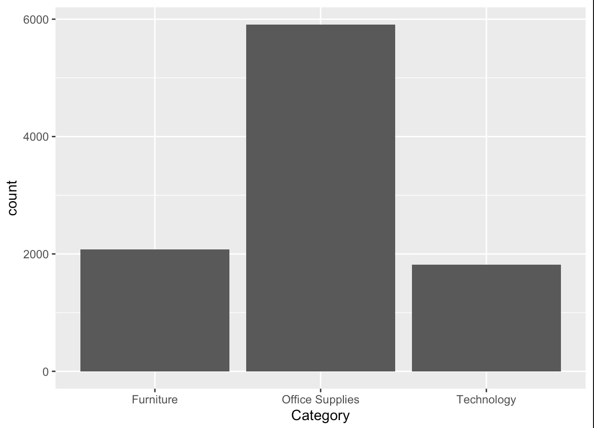
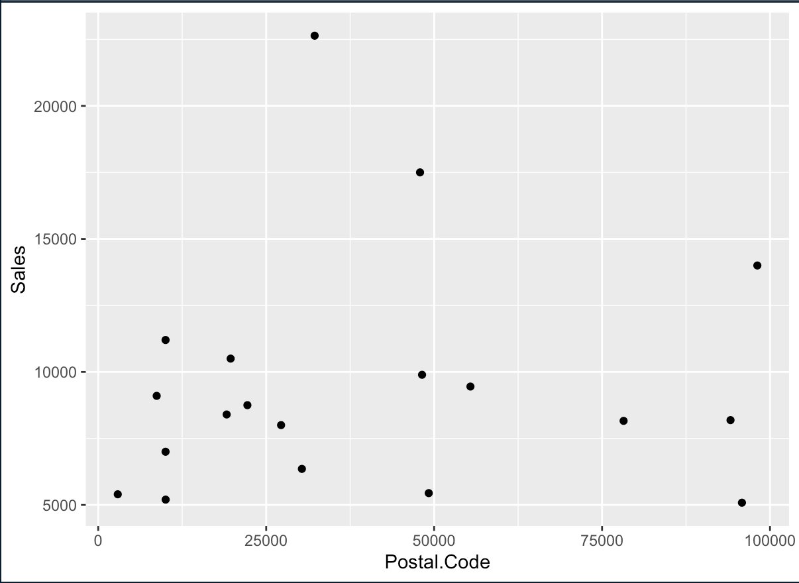

# R-Assignment 4

**Created by Natchapak Thaiprasit (ID: 63130500153)**


 Superstore Sales Dataset (Data from Rohit Sahoo,[Kaggle](https://www.kaggle.com/rohitsahoo/sales-forecasting)) >> [Using CSV](https://raw.githubusercontent.com/safesit23/INT214-Statistics/main/datasets/superstore_sales.csv)


### Outlines
1. Explore the dataset
2. Learning function from Tidyverse
3. Transform data with dplyr and finding insight the data
4. Visualization with GGplot2

## Part 1: Explore the dataset

```
# Library
library(dplyr)
library(readr)
library(ggplot2)


# Dataset
SuperStore <- read_csv("https://raw.githubusercontent.com/safesit23/INT214-Statistics/main/datasets/superstore_sales.csv")
```

In this dataset has 9,800 rows and 18 columns


## Part 2: Learning function from Tidyverse

- Function `tibble()` from package [tibble](https://tibble.tidyverse.org/reference/tibble.html)). It using for builds columns sequentially. When defining a column, you can refer to columns created earlier in the call. Only columns of length one are recycled.

```
tibble(x = 1:5, y = 1, z = x ^ 2 + y)
```

## Part 3: Transform data with dplyr and finding insight the data

1. SuperStore ทำการฟังชั่น filter Category เป็น Furniture และ Country เป็น United States 

```
SuperStore %>% filter(Category == "Furniture") %>% filter(Country == "United States")
```

Result:

```
 Row.ID       Order.ID Order.Date  Ship.Date      Ship.Mode Customer.ID
1       1 CA-2017-152156 08/11/2017 11/11/2017   Second Class    CG-12520
2       2 CA-2017-152156 08/11/2017 11/11/2017   Second Class    CG-12520
3       4 US-2016-108966 11/10/2016 18/10/2016 Standard Class    SO-20335
4       6 CA-2015-115812 09/06/2015 14/06/2015 Standard Class    BH-11710
5      11 CA-2015-115812 09/06/2015 14/06/2015 Standard Class    BH-11710
```

2. SuperStore ทำการฟังชั่น filter Category เป็น Technology และ ทำการตั้ง between โดยจัด format ของ Ship.Date โดยแยกวันเดือนปี จาก %d = วัน %m = เดือน %Y = ปี แล้วทำการเลือก %Y หาปีระหว่าง 2015 ถึง 2017

```
SuperStore %>% filter(Category == "Technology") %>% filter(between(format(as.Date(Ship.Date,"%d/%m/%Y"),"%Y"),2015,2017)) 
```

Result:


```
Row.ID       Order.ID Order.Date  Ship.Date      Ship.Mode Customer.ID
1       8 CA-2015-115812 09/06/2015 14/06/2015 Standard Class    BH-11710
2      12 CA-2015-115812 09/06/2015 14/06/2015 Standard Class    BH-11710
3      20 CA-2015-143336 27/08/2015 01/09/2015   Second Class    ZD-21925
4      27 CA-2017-121755 16/01/2017 20/01/2017   Second Class    EH-13945
5      36 CA-2017-117590 08/12/2017 10/12/2017    First Class    GH-14485
```
3. ทำการ SuperStore หาค่า MAX MIN MEAN Q1 Q3

```
SuperStore %>% summary() 
```

Result:

```
Row.ID       Order.ID          Order.Date         Ship.Date        
 Min.   :   1   Length:9800        Length:9800        Length:9800       
 1st Qu.:2451   Class :character   Class :character   Class :character  
 Median :4900   Mode  :character   Mode  :character   Mode  :character  
 Mean   :4900                                                           
 3rd Qu.:7350                                                           
 Max.   :9800  
```

4. SuperStore หาว่ามีประเทศกับเมืองไหนบ้างที่ไม่ซ้ำกันโดยใช้คำสั่ง distinct

```

SuperStore %>% distinct(Country,City)
```

Result:

```
Country             City
1   United States        Henderson
2   United States      Los Angeles
3   United States  Fort Lauderdale
4   United States          Concord
5   United States          Seattle
6   United States       Fort Worth
7   United States          Madison
8   United States      West Jordan
9   United States    San Francisco
10  United States          Fremont
```

5. SuperStore ทำการเลือก Product.Name , Sales ว่า Product.Name ไหนที่มี Sales มากกว่าหรือเท่ากับ 1 หมื่น

```
SuperStore %>% select(Product.Name,Sales) %>% filter(Sales >= 10000)
```

Result:

```
                                          Product.Name    Sales
1                 Canon imageCLASS 2200 Advanced Copier 11199.97
2 Cisco TelePresence System EX90 Videoconferencing Unit 22638.48
3                 Canon imageCLASS 2200 Advanced Copier 10499.97
4                 Canon imageCLASS 2200 Advanced Copier 17499.95
5                 Canon imageCLASS 2200 Advanced Copier 13999.96
```

6. ทำการ filter Region ต้องอยู่มีชื่อ Central และให้คำนวณว่ามี Region ชื่อ Central เท่าไหร่ โดยใช้ count

```
SuperStore %>% count(Region) %>% filter(Region == "Central")
```

Result:

```
   Region    n
1 Central 2277
```


## Part 4: Visualization with GGplot2
### 1.) Graph show count Category in SuperStore
```
SuperStore %>% ggplot(aes(x=Category)) + geom_bar()
```
Result:



### 2.) Graph show Postal Code and Sales by Sales more than 5000
```
SuperStore %>%  filter(Sales > 5000)%>% ggplot(aes(x=Postal.Code,y=Sales)) + geom_point() 
```

Result:


